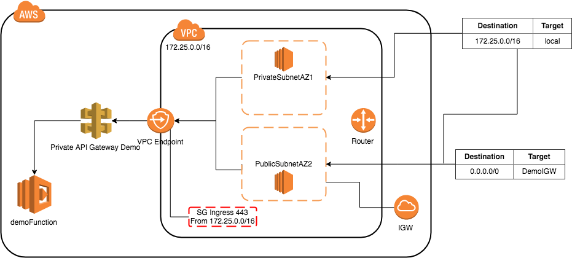

# Private API Gateway Demo
This demo setups infrastructure within AWS that enables the development of private api gateway enpoints. Use cases include internal to VPN restricted https services and/or the testing of sensitive api gateway lambdas in a secured vpc environment.

# Private API Gateway Demo Design

# Setup
1. In order for the golang function to be deployed to AWS Lambda it needs to be compiled. Executing `make` will gather dependencies, build binaries, and create zips bundles.

2. `cd infra && terraform apply`* Enter "yes" when prompted. Brining up the infrastructure will take a minute or two.

3. The `terraform apply` will output the URL with which you can `curl -X GET $URL` while connected via VPN to the VPC or from an EC2 launched within one of the private subnets.

*`infra/provider.tf` uses a named "tf" profile I defined within ~/.aws/config. You should remove or comment out `profile = "tf"` from that file to use the default profile.